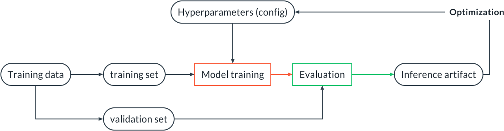
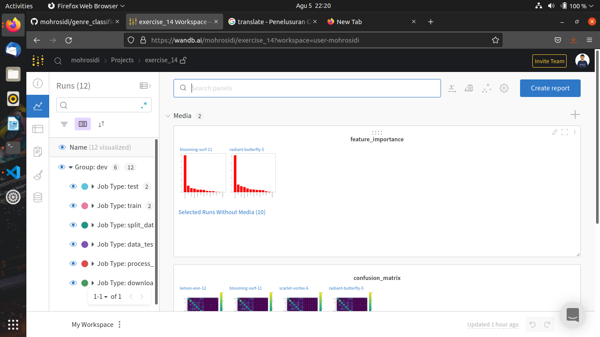
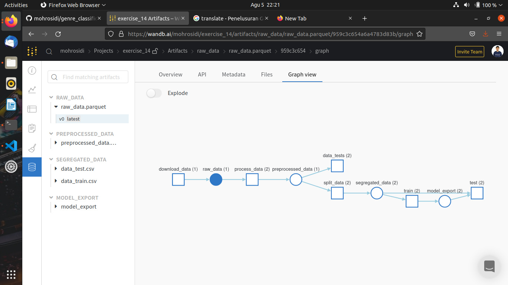

# Genre Classification

These are ML pipelines created as an assignment in Udacity's Machine Learning DevOps Engineer course.

## Project Descriptions

In this project, participants were asked to create a training pipeline and random forest model testing. The data used contains a number of song features with the target feature in the form of the genre of the song.

The training pipeline used is illustrated in the following figure:

The imported data has a parquet format which is read using Arrow. Data checking is done to check the structure and standards set on the data (see the run.py file in the check_data folder). Data preprocessing is done by filling in the missing values ​​and standardizing the numeric column. The next data is segregated into training data and testing data. The Random Forest model was then trained on the training data. The model is then evaluated on the test data and the AUC curve value is 0.95.

## How to run this project

1. Install wandb library (`pip install wandb`)
2. Create wandb account (www.wandb.ai)
3. Get your wandb API Key (run `wandb login`, open the urls that appears in your terminal) and paste in your terminal
4. Run the project (`mlflow run -v https://github.com/mohrosidi/genre_classification.git`)
5. When the run is finished, open your wandb account and see the report of your project

## Sample Report from Wandb

